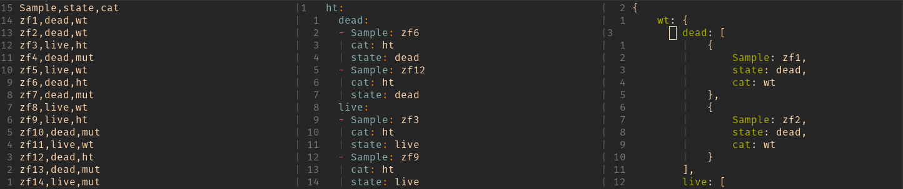

# Usage

To convert JSON data to YAML format, use the command `python csv2json2yaml.py json2yaml input_file.json output_file.yaml`, replacing `input_file.json` with the path to your JSON file and output_file.yaml with the desired output file name.

To convert CSV data to JSON format with grouping, use the command python `csv2json2yaml.py csv2json mycsv.csv --groupby column1,column2 --output name.json`, replacing `mycsv.csv` with the path to your CSV file, column1,column2 with the column names you want to group by (separated by commas), and `name.json` with the desired output file name.

The script now checks the command provided and executes the corresponding functionality: 'json2yaml' or 'csv2json'.

Please note that the script assumes the JSON data is in a valid format and matches the structure expected for conversion to YAML or grouping from CSV to JSON.
